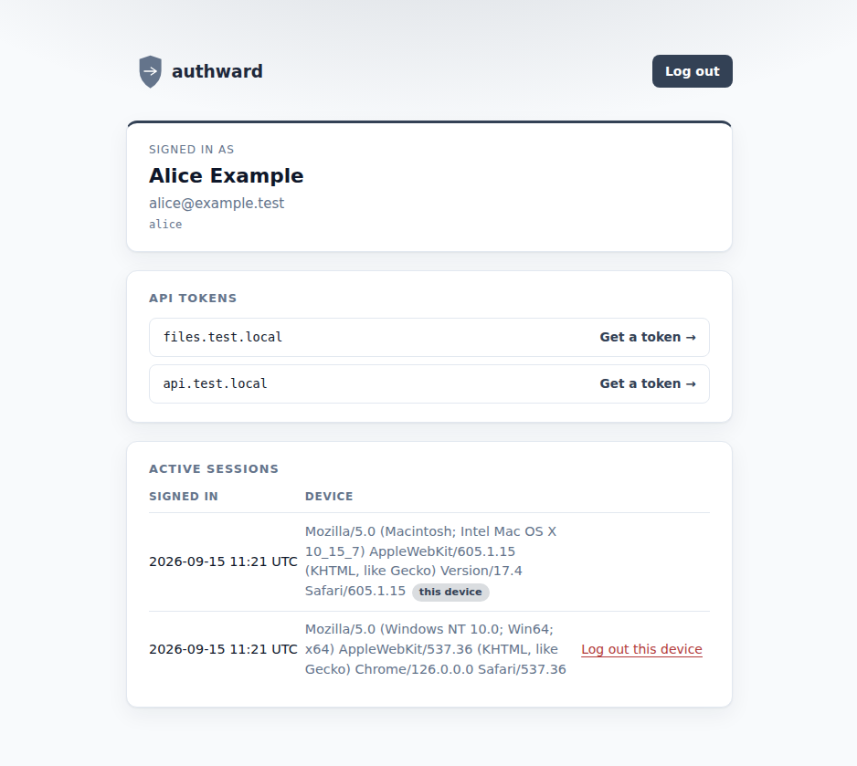
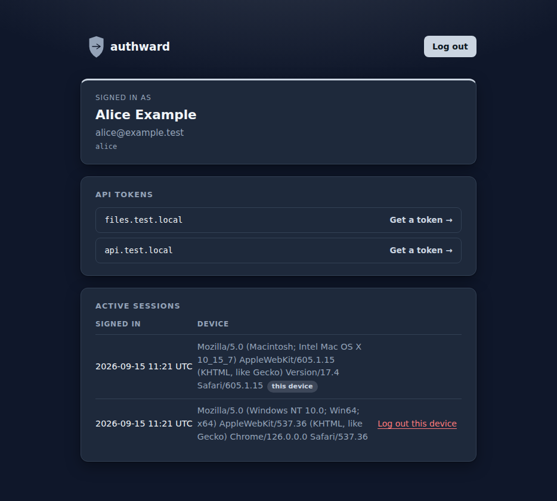
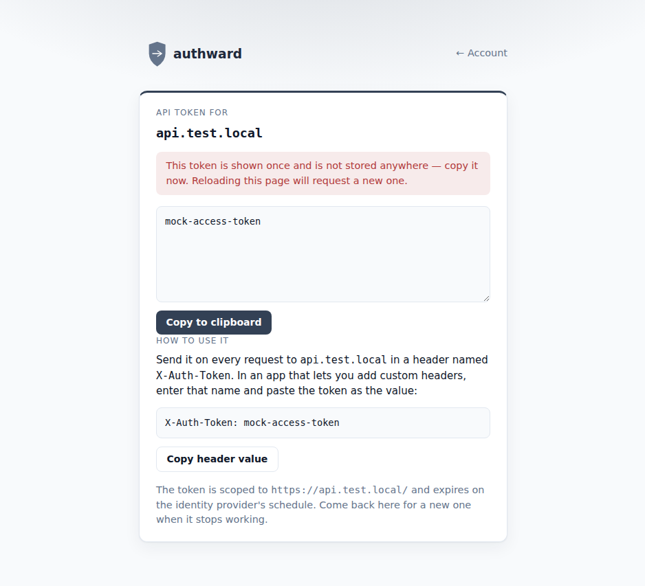
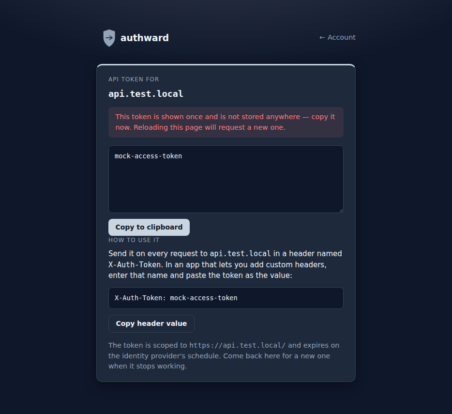

<p align="center">
  
  
</p>


A small Rust + Axum service that adds OIDC login in front of apps that
don't speak OIDC themselves, via Caddy's `forward_auth` directive. Built
for the "one OIDC provider, a few subdomains" case — config ergonomics
over generality, single instance, SQLite for session storage, no
external dependencies to run.

Start here:

- **[Quickstart](docs/quickstart.md)** — `authward init` walked
  through end to end, get something running before reading the rest.
- **[Deployment guide](docs/deployment.md)** — the binary, the config
  file, the trust-boundary requirement, and the Caddy setup.
- **[Config reference](docs/config-reference.md)** — every field on
  `[global]`, `[idp]`, `[domain]` (and its `fallback`), and `[host]`.
- **[Operational runbook](docs/runbook.md)** — key rotation, adding a
  host, domain or IdP, reading logs/traces for an auth failure, revoking
  access.
- **[API tokens](docs/api-tokens.md)** — resource-scoped bearer tokens
  for non-browser clients (CLIs, scripts), worked through on pocket-id.

See [`forward-auth-plan.md`](forward-auth-plan.md) for the full design
rationale and locked-in decisions this implementation follows, and
[`examples/config.toml`](examples/config.toml) /
[`deploy/Caddyfile`](deploy/Caddyfile) for copy-and-edit starting points.

## Screenshots

| | Light | Dark |
| --- | --- | --- |
| Dashboard |  |  |
| API token |  |  |

## Building

```sh
cargo build --release
```

## Testing

```sh
cargo test
```

`tests/login_flow.rs` runs the full login/refresh/authorization/API-token
suite against an in-process mock IdP. `tests/caddy_integration.rs` drives
the same flow through a real `caddy` binary if one is available on
`PATH` (or `CADDY_BIN`), and skips itself with a message otherwise.
